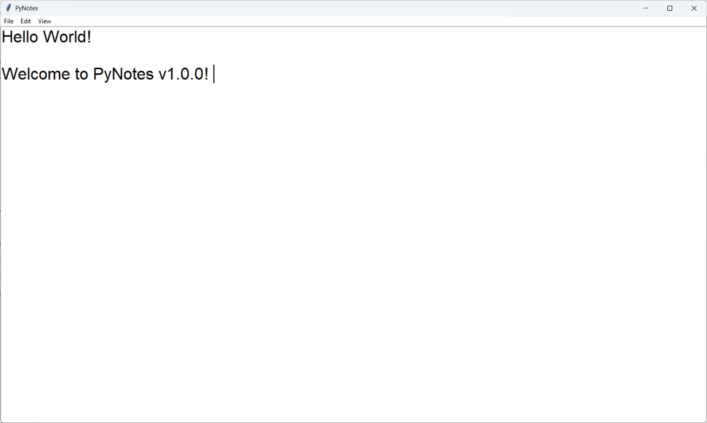
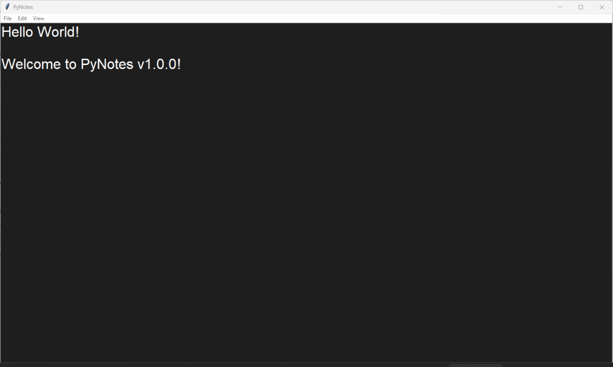

<table width="100%">
  <tr>
    <td align="left" width="120">
      
    </td>
    <td align="Left">
      <h1>PyNotes</h1>
      <h3 style="margin-top: -10px;">Open-Source, Ready to use Text Editor</h3>
    </td>
  </tr>
</table>

## ℹ️ Introduction 
PyNotes is an Open-Sourced, ready to use Text Editor suited for everyday tasks. It is available for both Windows and Linux.

## 🖼️ Screenshots

 

<em>Fig. 1 PyNotes GUI</em>

 

<em>Fig. 2 PyNotes GUI (Dark Mode)</em>

## 🛠️ Technologies Used
- **Python**: Efficient coding
- **Tkinter**: Python Framework for GUI Applications

## ✨ Features Implemented
✅ Text Formatting (Bold, Italic and Underline)  
✅ Dark Mode  
✅ Word Wrap  
✅ Zoom In/Out  
✅ Undo/Redo  
✅ Edit and View Menu Bars  
✅ Support for both Windows and Linux  
✅ Standalone application for both Windows and Linux  

## 🧰 Installation
### Prerequisites
Make sure you have python 3.10 or later installed.

1. Download and Extract the archive file (according to your OS) from the releases section.
2. Navigate to <b>dist</b> directory: `cd dist`
3. Run the PyNotes executable file.

## 🤝 Contributing
Contributions are welcomed! Make PyNotes even better by putting your expertise into it.  
Read [Contributing Guide](CONTRIBUTING.md) for more info regarding <b>Knows Issues</B> and <b>Focus Areas</b>.

### ❤️ Thank you for using/showing interest in PyNotes 😊
